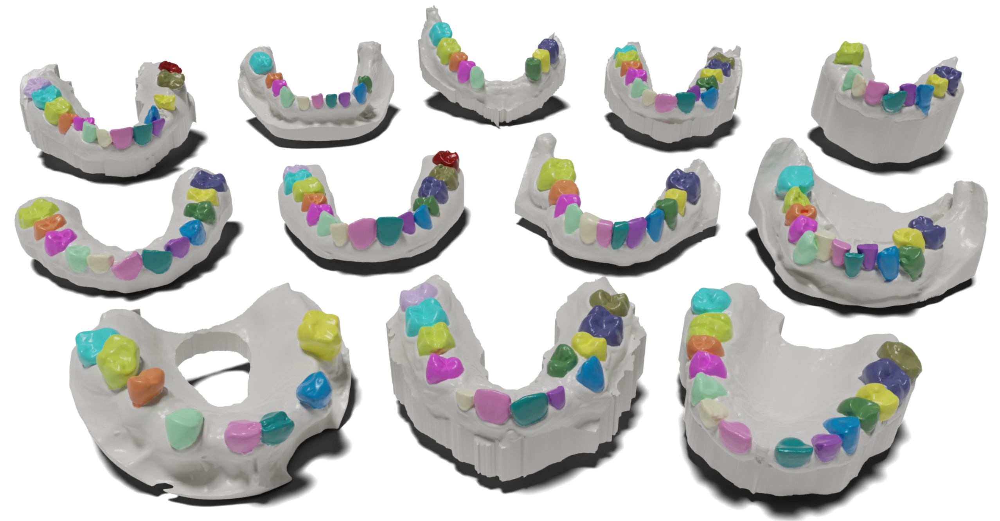

# 🦷 LMVSegRNN and Poseidon3D: Addressing Challenging Teeth Segmentation Cases in 3D Dental Surface Orthodontic Scans

<div align="center">
  <a href="https://www.mdpi.com/2306-5354/11/10/1014#"></a> &ensp;
</div>

<div align="center">
  
[Tibor Kubik](https://scholar.google.com/citations?user=Zb6MSKcAAAAJ) and [Michal Spanel](https://scholar.google.com/citations?hl=sk&user=75XIbgQAAAAJ)



</div>


## 🔥 News and Todo
* 💻 June 2025: Preparation of this GitHub repository and data release.

## Abstract
The segmentation of teeth in 3D dental scans is difficult due to variations in teeth shapes, misalignments, occlusions, or the present dental appliances. Existing methods consistently adhere to geometric representations, omitting the perceptual aspects of the inputs. In addition, current works often lack evaluation on anatomically complex cases due to the unavailability of such datasets. We present a projection-based approach towards accurate teeth segmentation that operates in a detect-and-segment manner locally on each tooth in a multi-view fashion. Information is spatially correlated via recurrent units. We show that a projection-based framework can precisely segment teeth in cases with anatomical anomalies with negligible information loss. It outperforms point-based, edge-based, and Graph Cut-based geometric approaches, achieving an average weighted IoU score of 0.97122 ± 0.038 and a Hausdorff distance at 95 percentile of 0.49012 ± 0.571 mm. We also release Poseidon’s Teeth 3D (Poseidon3D), a novel dataset of real orthodontic cases with various dental anomalies like teeth crowding and missing teeth.

## Requirements
The code was tested on

* Ubuntu 24.04
* Python 3.12
* PyTorch 2.7.0
* 1 NVIDIA GPU with CUDA version 11.8 (the method is not memory heavy, at least when using 256 embeddings, so any gpu with at least 8GB will work).

### Setup an environment
```shell
conda create -n lmvsegrnn python==3.12
conda activate lmvsegrnn
```
### Install PyTorch
```shell
pip install torch torchvision torchaudio --index-url https://download.pytorch.org/whl/cu118
```

### Other Dependencies
```shell
pip install -r requirements.txt
```
<mark>Note:</mark> to avoid dependency conflicts, please make sure to use the exact package versions specified in `requirements.txt`. 

## Data Preparation and Training
todo: describe how to generate synchronized embeddings and run training loop

## 🔗 BibTeX
If you find this work useful for your research and applications, please cite using this BibTeX:

```bibtex
@article{kubik24poseidon3d,
author = {Kubík, Tibor and Španěl, Michal},
title = {LMVSegRNN and Poseidon3D: Addressing Challenging Teeth Segmentation Cases in 3D Dental Surface Orthodontic Scans},
journal = {Bioengineering},
volume = {11},
year = {2024},
number = {10},
url = {https://www.mdpi.com/2306-5354/11/10/1014},
pubmedid = {39451390},
issn = {2306-5354},
doi = {10.3390/bioengineering11101014}
}
```
